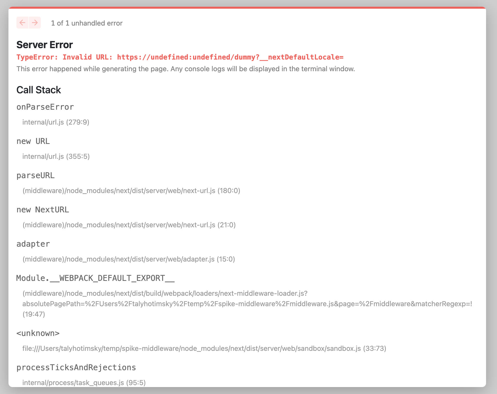

This repo mimics a setup we have internally, where we have custom logic to enable https while running nextJS in dev mode.

In order to run this repo locally and observe the issue, follow these steps:

1. Add the following line to your `hosts` file

```shell
127.0.0.1 localhost dev.mycustomdomain.com
```

2. Install dependencies

```shell
npm i
```

3. Start the server

```shell
npm run dev
```

4. Navigate to the page where middleware should kick in - https://dev.mycustomdomain.com:3000/dummy
5. You should see the same error we're getting
   
